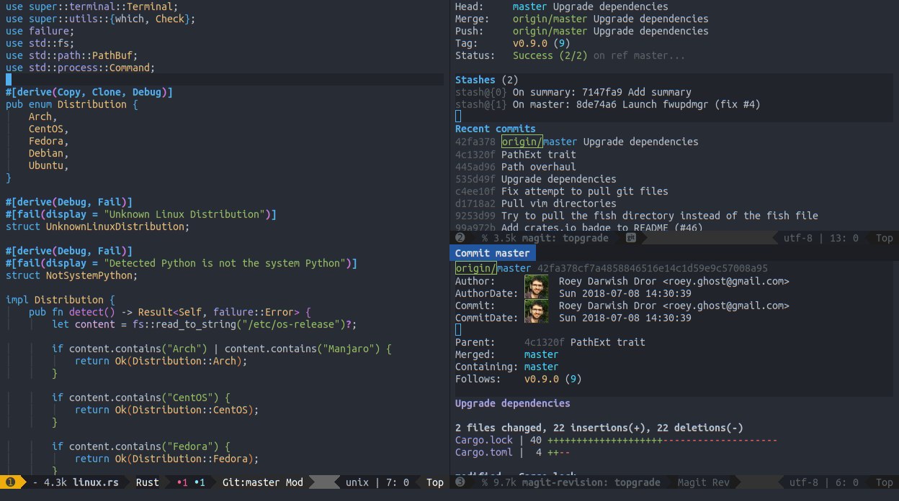

# Emacs

My personal Emacs configuration with contribution from friends.

Hopefully others might find this helpful. I don't believe in "starter-packs" such as
[oh-my-zsh](https://github.com/robbyrussell/oh-my-zsh/), [prelude](http://batsov.com/prelude/) or
[Spacemacs](http://spacemacs.org/). I feel like the "one size fits all" approach leads to bloat and
means that users are not familiar with either the tool or the options the package configured for
them.

I mostly assembled bits and pieces over time as the need grew, but some sources served as
inspiration and deserve explicit credit:

* [emacs-fu](http://www.djcbsoftware.nl/dot-emacs.html)
* [magnars/.emacs.d](https://github.com/magnars/.emacs.d)
* [vmalloc/emacs](https://github.com/vmalloc/emacs)

Notes:
* Emacs 26.1 is required, older version will not work.
* For spell checking to work an ispell compatible program and dictionary need to be installed,
  e.g. `aspell-en`.
* By default `cmark` is used to markdown export/preview so it needs to be installed.

## Working with Python

It's highly recommended to develop Python projects in virtual environment. Once you have a virtual
environment, use `C-c p E` to define the variable `pyvenv-activate` for the current project. Store
the path of the virtual environment inside this variable. Remember to quote that path with double
quotation marks.

It's also recommended to install the [Python Language
Server](https://github.com/palantir/python-language-server) inside your virtual environment, as well
as Pylint if you're interested.

If you follow these steps then when visiting a Python file, the modeline should show `Python
(ENV_NAME)` where `ENV_NAME` is the name of your virtual environment. The modeline should also
indicate that the Python Language Server is running by showing `LSP[pyls:pid]`.

### Auto formatting

This configuration supports automatic Python formatting on save. Since there's no consensus about a
Python formatting tool, or whether to use such at all, this feature is turned off and can be enabled
on project basis.

Two buffer local variables were created for this - `my/python-isort-on-save` which runs
[isort](https://github.com/timothycrosley/isort/) and `my/python-black-on-save` which runs
[black](https://github.com/ambv/black).

These variables are local buffer and are nil by default. They can be set for a given project by
using dir-local variables, just like `pyvenv-activate`. Use `C-c p E` to set them.
